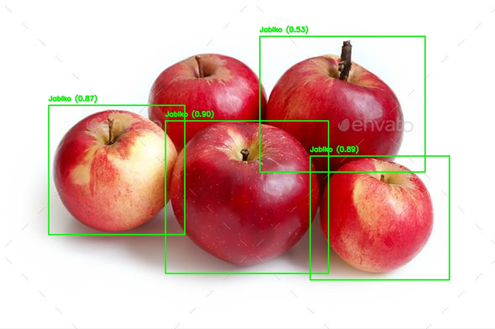
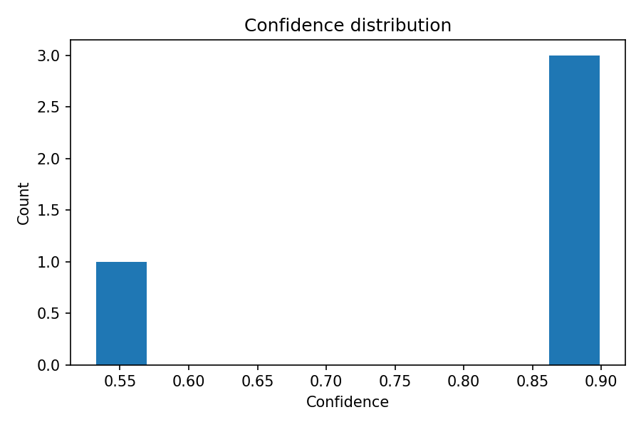
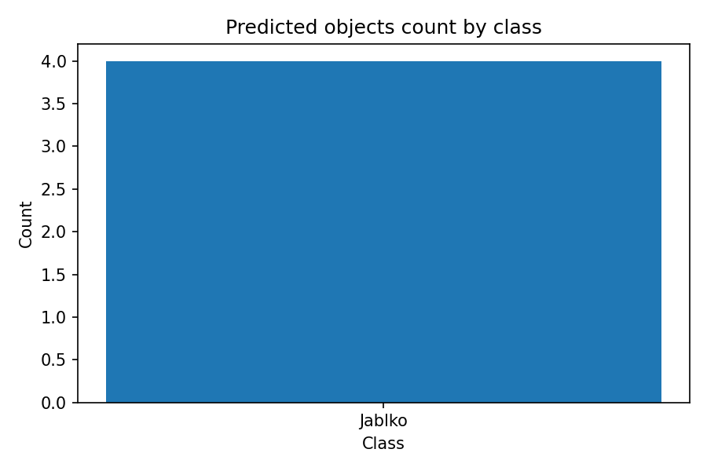

# AppleFinder

Small demo project for object detection with Roboflow. Includes:
- single-image inference (`run_image.py`)
- webcam inference (`run_webcam.py`)
- a notebook (`main.ipynb`) that saves results and plots to `outputs/`

Note: The bundled model is for demonstration only. It was trained on a very small dataset (~50 images of apples). Expect false positives on similar fruit and non-apple objects. See “Model notes” below.

## Roboflow model used
- Platform: Roboflow
- Model type: Roboflow 3.0 Object Detection (Fast)
- Example project slug: `applefinder-im9ep` (your slug will differ)
- Model ID format used in this repo: `project-slug/version`, e.g. `applefinder-im9ep/2`

## Requirements
- Python 3.9+
- Roboflow API key

## Installation
```bash
python -m venv .venv
. .venv/Scripts/Activate.ps1   # PowerShell (Windows)
# source .venv/bin/activate    # Linux/macOS
pip install -r requirements.txt
```

## Configuration
Create a `.env` file in the project root:
```env
ROBOFLOW_API_KEY=your_api_key_here
ROBOFLOW_MODEL_ID=applefinder-im9ep/2
ROBOFLOW_WORKSPACE=trening1   # optional; slug from the Roboflow URL
CONFIDENCE=50                 # 0-100
OVERLAP=50                    # 0-100
```
`.env` is ignored by Git.

## Usage
Single image:
```bash
python run_image.py path/to/image.jpg
# or simply:
python run_image.py           # falls back to sample.jpg if present
```
Outputs will be saved to `outputs/` and a publishable copy of the annotated image and charts will be copied to `docs/`:
- outputs: `result.jpg`, `predictions.json`, `confidence_hist.png`, `class_counts.png` (plus `processed_input.jpg` if upscaled)
- docs: `annotated.jpg`, `confidence_hist.png`, `class_counts.png`, `predictions.json`

Webcam (press `q` to exit):
```bash
python run_webcam.py
```

## Screenshots / Results
These screenshots are generated by the app and copied to the `docs/` folder so they render on GitHub:
**Note:** The model class name is `Jablko` (Polish for "Apple") because it was annotated that way during training.







## What happens after inference
- If detections > 0:
  - Annotated image is saved to `outputs/result.jpg` and copied to `docs/annotated.jpg`.
  - Raw predictions saved as `outputs/predictions.json` and copied to `docs/predictions.json`.
  - Charts saved to `outputs/confidence_hist.png` and `outputs/class_counts.png` and copied to `docs/`.
- If no detections:
  - `outputs/result.jpg` is the input image without boxes; a copy goes to `docs/annotated.jpg`.
  - `predictions.json` contains an empty array.
  - Placeholder charts with “No detections” are generated so `docs/` always shows something.

## Model notes (demo-quality)
- Trained on ~50 images of apples (single class). This is intentionally small for demo purposes.
- Expect domain shift issues and false positives (e.g., lemons detected as apples).
- For better accuracy:
  - raise data volume and diversity (200–300+ images),
  - add “hard negatives” (similar fruit without annotations),
  - consider multi-class training (e.g., add a “lemon” class),
  - tune `CONFIDENCE` (e.g., 70–85 for stricter predictions).

## Train your own model on Roboflow (quick guide)
1) Create a Roboflow account and a new Object Detection project.
2) Upload images (more is better; diverse lighting/backgrounds). For demo I used ~50 apple images.
3) Annotate bounding boxes for the target class(es) (e.g., `apple`).
4) Generate a dataset version and start training with “Roboflow 3.0 Object Detection (Fast)” (or choose Accurate for quality over speed).
5) After training, open the model page and note:
   - API key: Account → Settings → API Keys
   - Workspace slug: the first path segment in the URL (e.g., `https://app.roboflow.com/<workspace>/...`)
   - Project slug and version: visible in the model URL (e.g., `.../<project-slug>/models/<project-slug>/<version>`)
6) Put these values into `.env` as shown in Configuration and run this repo.

## Troubleshooting
- 401/403: check `ROBOFLOW_API_KEY`.
- 404: verify `ROBOFLOW_MODEL_ID` format `project-slug/version` (e.g., `applefinder-im9ep/2`) and optional `ROBOFLOW_WORKSPACE` slug.
- Webcam is black: try a different camera index or close other camera apps; 1280x720 is requested automatically.

## License
MIT
